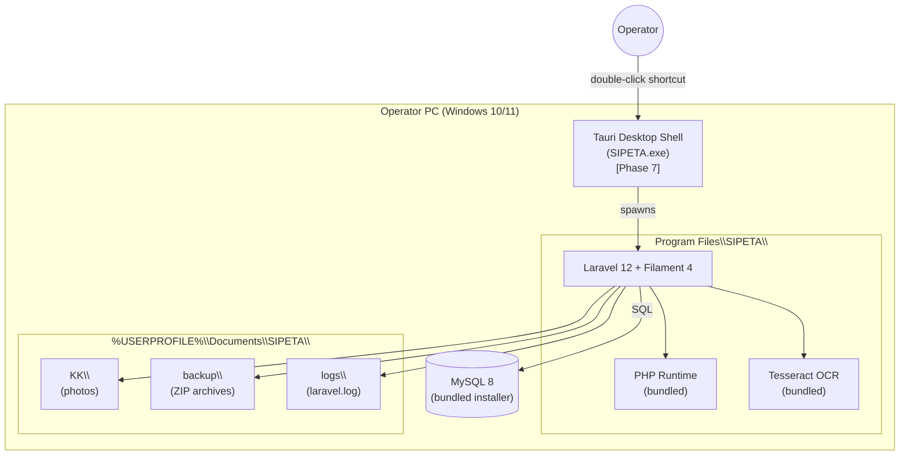

| Field | Value |
|---|---|
| **Title** | SIPETA Architecture |
| **Purpose** | Authoritative description of the runtime architecture, deployment topology, and module boundaries. |
| **Scope** | Desktop shell, backend, database, storage, backup, and Tauri packaging. Tauri is deferred to Phase 7. |
| **Version** | 1.2.0 |
| **Status** | Approved |
| **Last Updated** | 2026-08-03 |
| **Related Documents** | `.ai/hermes.md`, `.ai/database.md`, `.ai/workflow.md`, `.ai/ui-ux.md`, `.ai/coding.md`, `.ai/deployment.md`, `.ai/ocr.md`, `.ai/installation.md`, `.ai/roadmap.md`, `.ai/decisions.md` (ADR-025, ADR-026), `docs/REQUIREMENTS.md` |

---

# SIPETA Architecture

## 0. Two-Layer Architecture

The SIPETA application is built in two layers:

1. **Web application layer** (Phases 1–6). Laravel 12 + Filament 4 + MySQL 8 + Tesseract OCR. Runs in a browser during development; reproducible on any LAMP stack.
2. **Desktop packaging layer** (Phase 7 — deferred). Tauri 2 wrapper around the web application. Triggers only after Phase 6 is stable.

The Tauri CLI binary may already be installed on the developer machine as a developer tool (per ADR-025). It is not used inside the project until Phase 7 is explicitly started.

## 1. Overview

SIPETA is a desktop application for Windows built on:

- **Tauri 2** — desktop shell, native window, packaging *(integration deferred to Phase 7)*.
- **Laravel 12** — backend, business logic, persistence.
- **Filament 4** — admin UI (forms, tables, filters).
- **MySQL 8** — relational database.
- **Local File System** — KK photos, backups, logs.

The operator opens the application via a desktop shortcut. No terminal interaction is required at any point.

## 2. High-Level Architecture



### 2.1 Layer Topology

| Layer | Responsibility | Implementation |
|-------|----------------|----------------|
| Tauri Shell | Window, lifecycle, file URL handling | Rust + Tauri 2 *(Phase 7)* |
| HTTP Front | Renders UI, handles user input | Filament 4 + Alpine + TailwindCSS |
| Service Layer | Business logic | `App\Services\*` |
| Persistence | Database, file storage | Eloquent + Laravel Storage |
| Database | MySQL 8 InnoDB | Local MySQL server |

## 3. Main Modules

- **Dashboard** — KPI cards + 3 charts.
- **Data Penduduk** — single workspace for KK + Penduduk + OCR + Search + Filter + Export.
- **Laporan** — export PDFs and Excels.
- **Backup** — create / restore ZIP archives.
- **Pengaturan** — kelurahan identity, logo, backup path.

No additional modules are added without project owner approval.

## 4. Dashboard

Authoritative source of dashboard contents: `.ai/project-rules.md` §"Dashboard Rules" and `docs/REQUIREMENTS.md` §2.5.

Cards (counts of `ACTIVE` residents only):

- Penduduk Aktif
- Total KK
- Laki-laki
- Perempuan
- Pindah
- Meninggal

Charts:

- Penduduk per RT
- Penduduk per Lingkungan
- Penduduk per Pekerjaan

## 5. Data Penduduk — Single Workspace

The operator spends almost all working time inside Data Penduduk. The single page contains:

- Search bar
- Filter row
- Add Resident button (Upload KK / Manual)
- Table
- Export buttons
- Detail view

KK, Penduduk, OCR, search, filter, and export are not separate menus.

## 6. OCR Pipeline

See `.ai/ocr.md` for the pipeline. The OCR module is invoked from the "Upload Foto KK" path and never writes directly to the database.

## 7. Database Philosophy

- 4 production tables: `kartu_keluarga`, `penduduk`, `settings`, `backup_logs`.
- One KK → many Penduduk.
- One settings row (singleton).
- `backup_logs` is append-only.
- Never duplicate KK information across rows.
- Never store age.

Schema details: `.ai/database.md`.

## 8. Storage

### 8.1 Application Folder (read-only at runtime)

```
Program Files\SIPETA\
├── SIPETA.exe                       (Tauri shell)
├── resources\
│   ├── tesseract\tesseract.exe       (OCR binary)
│   └── tessdata\ind.traineddata     (Indonesian language pack)
├── runtime\                         (PHP runtime binaries)
├── laravel\                         (Laravel app code)
├── mysql\                           (MySQL server binaries)
└── installers\                      (used during first install)
```

### 8.2 Data Folder (read-write, survives upgrades)

```
%USERPROFILE%\Documents\SIPETA\
├── kk\
│   └── 0001.jpg, 0002.jpg, ...      (KK photo files)
├── backup\
│   ├── backup_2026-08-03_093000.zip
│   └── backup_2026-08-10_143000.zip
├── logs\
│   ├── laravel.log
│   └── ocr.log
└── config\
    └── sipeta.ini                   (DB credentials, paths)
```

### 8.3 Separation Rules

- Application files are installed under `Program Files\SIPETA\`.
- Data files are under `%USERPROFILE%\Documents\SIPETA\`.
- Upgrades replace application files but **never** touch the data folder.
- The data folder is what backups capture.

## 9. Filtering

See `.ai/project-rules.md` §"Filter Rules" for the authoritative list. The Data Penduduk page exposes all filters without opening a modal.

## 10. Population Status

See `.ai/project-rules.md` §"Resident Status" for the authoritative definition. Enum: `App\Enums\ResidentStatus`.

## 11. Backup

See `.ai/project-rules.md` §"Backup Rules" and `docs/REQUIREMENTS.md` §2.7.

Backup is a ZIP archive containing:

- SQL dump (via `mysqldump`).
- `storage/kk/` photos.
- `settings` row.

Filename pattern: `backup_YYYY-MM-DD_HHMMSS.zip`. Previous backups are never overwritten.

## 12. Deployment

See `.ai/deployment.md` for the full plan. Summary:

- Development: Parrot OS.
- Production: Windows 10/11.
- Build pipeline: Laravel → Tauri → Inno Setup → `.exe` installer.
- Install: double-click installer, choose folder, completes in < 5 minutes.
- Operator: double-click desktop shortcut.

**Phase 7 only.** The Tauri / Inno Setup steps are deferred until Phase 7 is explicitly started.

## 13. Performance Strategy

- **Dashboard** — KPI counts precomputed on a 5-minute cache (cache invalidated on Penduduk CREATE/UPDATE/STATUS change).
- **Search** — uses indexed columns (`nik`, `full_name`, `kk_number`).
- **Filter** — query scopes, not application-side filtering.
- **Export** — stream rows via Laravel Excel `FromQuery` and DomPDF `chunk()`.
- **OCR** — synchronous but with a 10-second timeout per image.

## 14. Caching Strategy

- **Cache store**: file-based (no Redis in KKN scope).
- **Cache keys**:
  - `dashboard.stats` — invalidated on Penduduk mutations.
  - `dashboard.charts.rt` — invalidated on Penduduk mutations.
  - `dashboard.charts.lingkungan` — invalidated on Penduduk mutations.
  - `dashboard.charts.occupation` — invalidated on Penduduk mutations.
- **TTL**: 5 minutes (whichever comes first between mutation and TTL).

## 15. Logging Strategy

- **Application log**: `storage/logs/laravel.log` (rotated daily, max 14 days).
- **OCR log**: `storage/logs/ocr.log` (rotated daily, max 7 days).
- **Backup log**: stored in `backup_logs` table.
- **Operator visibility**: none. Logs are for developer diagnostics only.

## 16. Security Architecture

- All inputs validated via Form Request.
- All outputs escaped via Blade/Eloquent.
- File uploads validated by MIME and size.
- Database user `sipeta_app` has privileges: `SELECT`, `INSERT`, `UPDATE`, `DELETE` on `sipeta` schema only. No `DROP`, `GRANT`, `CREATE USER`.
- Tesseract binaries cannot be replaced at runtime (read-only install location).
- Stack traces are never shown to the operator.

## 17. Future Expansion (Reserved for `docs/BACKLOG.md`)

- Multi-computer LAN sync
- Automatic in-app updates
- Cloud backup
- LLM-based OCR fallback
- External API

These are explicitly out of KKN scope.

## 18. Non-Functional Requirements

Authoritative source: `docs/REQUIREMENTS.md` §3. Summary highlights:

- Fast search (≤ 500 ms on 50K records)
- Responsive UI
- Simple workflow
- Reliable backup
- Easy maintenance
- Minimal training

## 19. Architecture Principles

- Simplicity over complexity.
- Reliability over extra features.
- Finish core modules first.
- Never redesign without project owner approval.
- Keep deployment simple.
- Data integrity over performance.

## 20. Implementation Notes

- Auth uses Filament's built-in auth with a single admin user.
- Storage paths are absolute at runtime, relative in code via `storage_path()`.
- File uploads use Tauri-friendly paths (no symlinks).
- Service layer code is the only place where business logic lives. Controllers and Filament Resources are thin.

## 21. Future Improvements

- Move cache facility to Redis if multi-user is enabled.
- Add a separate `audit_logs` table for compliance.
- Add WebView2 pinning for Tauri to avoid version drift (when Phase 7 starts).
