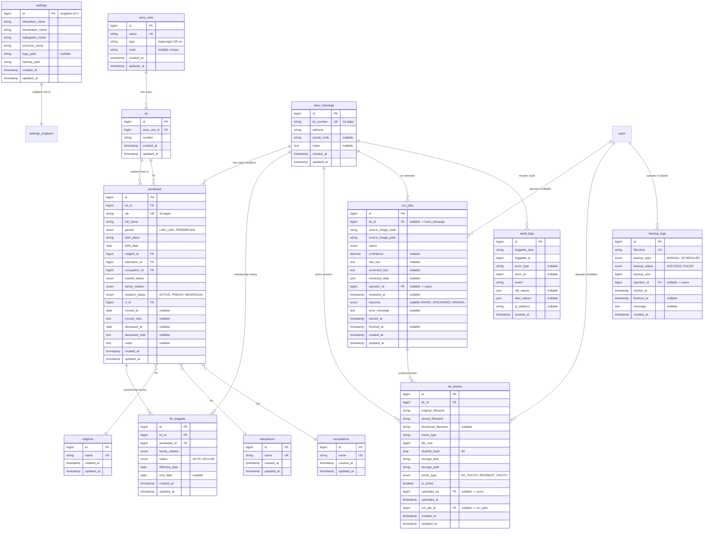

| Field | Value |
|---|---|
| **Title** | SIPETA Database Design |
| **Purpose** | Authoritative schema, relationship, validation, and migration rules for SIPETA. |
| **Scope** | MySQL 8 schema, indexes, foreign keys, naming conventions, age computation, OCR data rules. |
| **Version** | 1.2.0 |
| **Status** | Approved |
| **Last Updated** | 2026-08-05 |
| **Related Documents** | `.ai/hermes.md`, `.ai/architecture.md`, `.ai/workflow.md`, `.ai/ocr.md`, `.ai/project-rules.md`, `.ai/coding.md`, `.ai/testing.md`, `docs/REQUIREMENTS.md`, `docs/FEATURES.md`, `docs/PHASE2.md` |

---

# SIPETA Database Design

This document is the authoritative reference for the SIPETA database. All AI agents MUST follow it. Schema changes require updating this document first.

> **Schema-of-record notice (2026-08-05).** This document was rewritten in Phase 2.2 to match the 13 domain migrations that were committed. The previous 4-table draft (`kartu_keluarga`, `penduduk`, `settings`, `backup_logs` only) is superseded. Lookup masters, region hierarchy, OCR/photo/audit tables are now part of the approved schema. `resident_status` values are `ACTIVE` / `PINDAH` / `MENINGGAL` (Indonesian), not `MOVED` / `DECEASED`.

## 1. Database Engine

- **Engine**: MySQL 8.0+
- **Storage**: InnoDB only
- **Charset**: `utf8mb4`
- **Collation**: `utf8mb4_unicode_ci`
- **Time zone**: server local time (configured at install)

## 2. Design Principles

1. Normalize data where practical.
2. Never duplicate KK information across rows.
3. Never store age.
4. Prefer integer foreign keys.
5. Preserve historical data (membership history, append-only logs).
6. Index every searchable column.
7. Document every constraint.
8. Schema changes are migration-driven; never edit released migrations.

## 3. Entity Relationship Diagram



## 4. Relationship Explanations

### 4.1 `kartu_keluarga` → `penduduk` (one-to-many)

- One KK can contain many residents.
- Foreign key: `penduduk.kk_id → kartu_keluarga.id`.
- On delete: **restrict** (cannot delete a KK that still has residents).
- On update: **cascade**.
- The resident's *current* KK is `penduduk.kk_id`; full history lives in `kk_anggota`.

### 4.2 `penduduk` → lookup masters & `rts`

- `penduduk.religion_id → religions.id` (**restrict**), `education_id → educations.id` (**restrict**), `occupation_id → occupations.id` (**restrict**), `rt_id → rts.id` (**restrict**).
- `religion` / `education` / `occupation` are **lookup-data tables** (evolving taxonomies), not DB enums.
- `rts` belongs to `area_units` (`rts.area_unit_id → area_units.id`, **restrict**).

### 4.3 `penduduk.resident_status`

- Independent field, not a foreign key.
- Allowed values: `ACTIVE`, `PINDAH`, `MENINGGAL` (Indonesian for active / moved / deceased).
- Validated via enum: `App\Enums\ResidentStatus`.
- Default: `ACTIVE`.
- When `PINDAH`: `moved_at` + `moved_destination` + `moved_note` populated.
- When `MENINGGAL`: `deceased_at` + `deceased_note` populated.

### 4.4 `kk_anggota` (membership history)

- Links a resident to a KK across re-issues (`kk_anggota.kk_id → kartu_keluarga.id` RESTRICT, `penduduk_id → penduduk.id` RESTRICT).
- `status` ∈ `AKTIF`, `KELUAR`. The active row mirrors `penduduk.kk_id`.
- On re-issue to a new KK number, the old link is set `KELUAR` with `end_date`; a new `AKTIF` row is added. History is preserved.

### 4.5 `kk_photos` (versioned archive)

- `kk_photos.kk_id → kartu_keluarga.id` (**restrict**); `uploaded_by → users.id` (**set null**); `ocr_job_id → ocr_jobs.id` (**set null**).
- Exactly one row per `kk_id` has `is_active = true` (enforced in the Service layer).
- `photo_type` ∈ `KK_PHOTO`, `RESIDENT_PHOTO`.

### 4.6 `ocr_jobs` (OCR audit, never source of truth)

- `ocr_jobs.kk_id → kartu_keluarga.id` (**set null** — an OCR attempt may not be attached to a KK yet); `operator_id → users.id` (**set null**).
- `status` ∈ `PENDING`, `SUCCESS`, `LOW_CONFIDENCE`, `FAILED`, `CANCELLED`.
- `outcome` ∈ `SAVED`, `DISCARDED`, `MANUAL` (nullable until reviewed).
- `extracted_data` is JSON; the operator decides whether to save into `penduduk`.

### 4.7 `settings` (singleton)

- Only one row exists (`id = 1`).
- Application code enforces this at the Service layer (`firstOrCreate(['id' => 1], ...)`).
- The DB does not enforce a singleton via constraint (MySQL has no partial unique index).

### 4.8 `backup_logs` (append-only)

- No foreign key to business tables. `operator_id → users.id` is **set null**.
- No `updated_at` column — append-only by design.
- Never updated or deleted; cleanup is by date, not by row identity.

### 4.9 `audit_logs` (morphic, append-only)

- No hard foreign key — audit must outlive the row it describes. `loggable_type` / `loggable_id` are morphic; `actor_type` / `actor_id` (nullable, morphic to `users`) record who acted.
- No `updated_at` column — append-only by design.
- Written by Laravel Model Observers in the application phase (Q3).

## 5. Table: `kartu_keluarga`

Purpose: store household-level information.

### 5.1 Columns

| Column | Type | Null | Default | Notes |
|--------|------|------|---------|-------|
| `id` | `BIGINT UNSIGNED` | NO | AUTO_INCREMENT | Primary key |
| `kk_number` | `VARCHAR(16)` | NO | — | Unique; 16 digits |
| `address` | `VARCHAR(255)` | NO | — | Full street address |
| `postal_code` | `VARCHAR(10)` | YES | NULL | Optional |
| `notes` | `TEXT` | YES | NULL | Optional |
| `created_at` | `TIMESTAMP` | NO | — | Eloquent-managed |
| `updated_at` | `TIMESTAMP` | NO | — | Eloquent-managed |

### 5.2 Constraints & Indexes

- `UNIQUE (kk_number)` — enforces uniqueness.
- `INDEX (address)` — for search.
- Foreign keys: none inbound from other business tables except the RESTRICT links from `penduduk`, `kk_anggota`, `kk_photos`, `ocr_jobs`.

### 5.3 Validation Rules (Form Request)

- `kk_number`: required, string, size:16, regex:/^[0-9]{16}$/, unique.
- `address`: required, string, max:255.
- `postal_code`: nullable, string, max:10.
- `notes`: nullable, string, max:5000.

## 6. Table: `penduduk`

Purpose: store every individual resident.

### 6.1 Columns

| Column | Type | Null | Default | Notes |
|--------|------|------|---------|-------|
| `id` | `BIGINT UNSIGNED` | NO | AUTO_INCREMENT | Primary key |
| `kk_id` | `BIGINT UNSIGNED` | NO | — | FK → `kartu_keluarga.id` |
| `nik` | `VARCHAR(16)` | NO | — | Unique; 16 digits |
| `full_name` | `VARCHAR(150)` | NO | — | — |
| `gender` | `ENUM('LAKI_LAKI','PEREMPUAN')` | NO | — | — |
| `birth_place` | `VARCHAR(100)` | NO | — | — |
| `birth_date` | `DATE` | NO | — | Year 1900–current |
| `religion_id` | `BIGINT UNSIGNED` | NO | — | FK → `religions.id` |
| `education_id` | `BIGINT UNSIGNED` | NO | — | FK → `educations.id` |
| `occupation_id` | `BIGINT UNSIGNED` | NO | — | FK → `occupations.id` |
| `marital_status` | `ENUM('BELUM_KAWIN','KAWIN','CERAI_HIDUP','CERAI_MATI')` | NO | — | — |
| `family_relation` | `ENUM('KEPALA_KELUARGA','ISTRI','ANAK','MENANTU','CUCU','ORANG_TUA','MERTUA','FAMILI_LAIN','LAINNYA')` | NO | — | — |
| `resident_status` | `ENUM('ACTIVE','PINDAH','MENINGGAL')` | NO | 'ACTIVE' | — |
| `rt_id` | `BIGINT UNSIGNED` | NO | — | FK → `rts.id` |
| `moved_at` | `DATE` | YES | NULL | Required when status = PINDAH |
| `moved_destination` | `VARCHAR(150)` | YES | NULL | — |
| `moved_note` | `TEXT` | YES | NULL | — |
| `deceased_at` | `DATE` | YES | NULL | Required when status = MENINGGAL |
| `deceased_note` | `TEXT` | YES | NULL | — |
| `notes` | `TEXT` | YES | NULL | — |
| `created_at` | `TIMESTAMP` | NO | — | — |
| `updated_at` | `TIMESTAMP` | NO | — | — |

### 6.2 Constraints & Indexes

- `UNIQUE (nik)` — enforces uniqueness.
- `FOREIGN KEY (kk_id) REFERENCES kartu_keluarga(id) ON DELETE RESTRICT ON UPDATE CASCADE`.
- `FOREIGN KEY (religion_id) REFERENCES religions(id) ON DELETE RESTRICT ON UPDATE CASCADE`.
- `FOREIGN KEY (education_id) REFERENCES educations(id) ON DELETE RESTRICT ON UPDATE CASCADE`.
- `FOREIGN KEY (occupation_id) REFERENCES occupations(id) ON DELETE RESTRICT ON UPDATE CASCADE`.
- `FOREIGN KEY (rt_id) REFERENCES rts(id) ON DELETE RESTRICT ON UPDATE CASCADE`.
- `INDEX (full_name)` — for search.
- `INDEX (resident_status)` — for filtering.
- `INDEX (gender)` — for filtering.
- `INDEX (birth_date)` — for age-related queries.
- `INDEX (rt_id)`, `INDEX (religion_id)`, `INDEX (education_id)`, `INDEX (occupation_id)` — for filtering.
- `INDEX (kk_id, resident_status)` — composite for "active residents in this KK".
- `INDEX (blood_type)` — for filtering.

### 6.3 Validation Rules (Form Request)

- `kk_id`: required, integer, exists:kartu_keluarga,id.
- `nik`: required, string, size:16, regex:/^[0-9]{16}$/, unique.
- `full_name`: required, string, max:150.
- `gender`: required, in:LAKI_LAKI,PEREMPUAN.
- `birth_place`: required, string, max:100.
- `birth_date`: required, date, before_or_equal:today, after:1900-01-01.
- `religion_id`: required, integer, exists:religions,id.
- `education_id`: required, integer, exists:educations,id.
- `occupation_id`: required, integer, exists:occupations,id.
- `marital_status`: required, enum value.
- `family_relation`: required, enum value.
- `resident_status`: required, enum value.
- `rt_id`: required, integer, exists:rts,id.
- `moved_at`: required_if:resident_status,PINDAH, date.
- `moved_destination`: required_if:resident_status,PINDAH, string, max:150.
- `moved_note`: required_if:resident_status,PINDAH, string, max:5000.
- `deceased_at`: required_if:resident_status,MENINGGAL, date.
- `deceased_note`: required_if:resident_status,MENINGGAL, string, max:5000.

### 6.4 Age Rule

- Never store age.
- Compute age at read time:
  ```php
  Carbon::parse($penduduk->birth_date)->age;
  ```
- All reports and the dashboard use computed age.

## 7. Table: `settings`

Purpose: store singleton configuration.

### 7.1 Columns

| Column | Type | Null | Default | Notes |
|--------|------|------|---------|-------|
| `id` | `BIGINT UNSIGNED` | NO | AUTO_INCREMENT | Primary key (singleton id=1) |
| `kelurahan_name` | `VARCHAR(150)` | NO | 'Kelurahan Tanete' | — |
| `kecamatan_name` | `VARCHAR(150)` | NO | — | — |
| `kabupaten_name` | `VARCHAR(150)` | NO | — | — |
| `province_name` | `VARCHAR(150)` | NO | — | — |
| `logo_path` | `VARCHAR(255)` | YES | NULL | Relative to `storage/logos/` |
| `backup_path` | `VARCHAR(255)` | NO | — | Absolute path |
| `created_at` | `TIMESTAMP` | NO | — | — |
| `updated_at` | `TIMESTAMP` | NO | — | — |

### 7.2 Singleton Enforcement

The Service layer enforces singleton semantics (`firstOrCreate(['id' => 1], [...])`). DB-level enforcement is not used because MySQL lacks partial unique indexes.

## 8. Table: `backup_logs`

Purpose: append-only log of every backup attempt. **No `updated_at`.**

### 8.1 Columns

| Column | Type | Null | Default | Notes |
|--------|------|------|---------|-------|
| `id` | `BIGINT UNSIGNED` | NO | AUTO_INCREMENT | Primary key |
| `filename` | `VARCHAR(255)` | NO | — | Unique |
| `backup_type` | `ENUM('MANUAL','SCHEDULED')` | NO | 'MANUAL' | — |
| `backup_status` | `ENUM('SUCCESS','FAILED')` | NO | — | — |
| `backup_size` | `BIGINT UNSIGNED` | NO | — | Bytes |
| `operator_id` | `BIGINT UNSIGNED` | YES | NULL | FK → `users.id` (SET NULL) |
| `started_at` | `TIMESTAMP` | NO | — | — |
| `finished_at` | `TIMESTAMP` | YES | NULL | — |
| `message` | `TEXT` | YES | NULL | Failure reason if any |
| `created_at` | `TIMESTAMP` | NO | — | — |

### 8.2 Constraints & Indexes

- `UNIQUE (filename)`.
- `INDEX (started_at)` — for listing/sorting backups by start time (added in Phase 2.5 index fix).
- `operator_id` FK → `users.id` ON DELETE SET NULL.

## 9. Table: `audit_logs`

Purpose: morphic audit trail. **No `updated_at`.**

### 9.1 Columns

| Column | Type | Null | Default | Notes |
|--------|------|------|---------|-------|
| `id` | `BIGINT UNSIGNED` | NO | AUTO_INCREMENT | Primary key |
| `loggable_type` | `VARCHAR(255)` | NO | — | Morph class |
| `loggable_id` | `BIGINT UNSIGNED` | NO | — | Morph id |
| `actor_type` | `VARCHAR(255)` | YES | NULL | Morph class (users) |
| `actor_id` | `BIGINT UNSIGNED` | YES | NULL | Morph id (users) |
| `event` | `VARCHAR(255)` | NO | — | created/updated/status_changed/restored |
| `old_values` | `JSON` | YES | NULL | — |
| `new_values` | `JSON` | YES | NULL | — |
| `ip_address` | `VARCHAR(45)` | YES | NULL | — |
| `created_at` | `TIMESTAMP` | NO | — | — |

### 9.2 Constraints & Indexes

- `INDEX (loggable_type, loggable_id)` — for per-record history.
- `INDEX (actor_id)` — for per-operator history.
- `INDEX (created_at)` — for ordering.
- No hard FK (audit must outlive the audited row).

## 10. Lookup, Region & OCR Tables (Phase 2.2 additions)

### 10.1 `religions` / `educations` / `occupations`

Lookup taxonomies (evolving data, not enums). Columns: `id` PK, `name VARCHAR` UNIQUE, `created_at`, `updated_at`. Seeded by `ReligionSeeder`, `EducationSeeder`, `OccupationSeeder`.

### 10.2 `area_units` / `rts`

Region hierarchy. `area_units`: `id`, `name` UNIQUE, `type` enum-like `('lingkungan','rw')`, `code` nullable UNIQUE, timestamps. `rts`: `id`, `area_unit_id` FK→area_units (RESTRICT), `number`, timestamps; `UNIQUE (area_unit_id, number)`. Seeded by `RegionSeeder`.

### 10.3 `kk_anggota` / `kk_photos` / `ocr_jobs`

See §4.4, §4.5, §4.6 for columns, FKs and indexes. Indexes added in migrations:
- `kk_anggota`: `kk_id`, `penduduk_id`, `status`, `effective_date`.
- `kk_photos`: `(kk_id, is_active)`, `sha256_hash`, `ocr_job_id`, `uploaded_by`.
- `ocr_jobs`: `source_image_hash`, `(status, created_at)`, plus `kk_id` (added in Phase 2.5 index fix).

## 11. Naming Conventions

| Object | Convention | Example |
|--------|------------|---------|
| Tables | `snake_case` plural where natural | `kartu_keluarga`, `penduduk`, `backup_logs` |
| Columns | `snake_case` | `kk_number`, `full_name` |
| Primary key | `id` (BIGINT UNSIGNED) | `id` |
| Foreign key | `<parent_singular>_id` | `kk_id` |
| Unique columns | descriptive | `kk_number`, `nik` |
| Timestamps | `created_at`, `updated_at` | — |
| Enums (DB) | `UPPER_SNAKE` | `ACTIVE`, `LAKI_LAKI` |
| Enums (PHP) | PascalCase class, UPPER_SNAKE cases | `ResidentStatus::ACTIVE` |
| Models | Singular PascalCase | `KartuKeluarga`, `Penduduk` |
| Services | `<Domain>Service` | `ResidentService`, `KKService` |

Never use the KK number or NIK as a foreign key.

## 12. Migration Rules

1. Every migration MUST define foreign keys, indexes, and unique constraints.
2. Every migration MUST have a `down()` rollback.
3. Never edit a released migration. Create a new one.
4. Migration filenames: `YYYY_MM_DD_HHMMSS_description.php`.
5. Migrations run in order. Use timestamps for sequencing.
6. Always run `php artisan migrate:fresh` in a dev environment to verify rollback works.
7. The two index-only migrations (`…_101300_…`, `…_101400_…`) are additive and do not alter released tables.

## 13. Eloquent Relationships (Reference)

```php
class KartuKeluarga extends Model
{
    protected $table = 'kartu_keluarga';

    public function penduduks(): HasMany
    {
        return $this->hasMany(Penduduk::class, 'kk_id');
    }

    public function kkAnggotas(): HasMany
    {
        return $this->hasMany(KkAnggota::class, 'kk_id');
    }

    public function kkPhotos(): HasMany
    {
        return $this->hasMany(KkPhoto::class, 'kk_id');
    }

    public function ocrJobs(): HasMany
    {
        return $this->hasMany(OcrJob::class, 'kk_id');
    }
}

class Penduduk extends Model
{
    protected $table = 'penduduk';

    public function kartuKeluarga(): BelongsTo
    {
        return $this->belongsTo(KartuKeluarga::class, 'kk_id');
    }

    public function religion(): BelongsTo
    {
        return $this->belongsTo(Religion::class);
    }

    public function education(): BelongsTo
    {
        return $this->belongsTo(Education::class);
    }

    public function occupation(): BelongsTo
    {
        return $this->belongsTo(Occupation::class);
    }

    public function rt(): BelongsTo
    {
        return $this->belongsTo(Rt::class);
    }

    public function scopeActive(Builder $query): Builder
    {
        return $query->where('resident_status', ResidentStatus::ACTIVE->value);
    }

    public function getAgeAttribute(): int
    {
        return Carbon::parse($this->birth_date)->age;
    }
}
```

> Note: `$table` is set explicitly on every model because several table names (`penduduk`, `kartu_keluarga`, `kk_anggota`, `kk_photos`, `ocr_jobs`) do not follow Laravel's English singular→plural inference.

## 14. Soft-Delete Policy

**No table uses `deleted_at` / `SoftDeletes`.** Resident lifecycle is handled by `resident_status` (ACTIVE / PINDAH / MENINGGAL) on `penduduk` plus `kk_anggota.status` (AKTIF / KELUAR) for membership history. Audit and backup logs are append-only. This is an explicit schema decision (ADR-007 family) and is verified by the Phase 2.5 test `SchemaTest::test_no_soft_delete_columns`.

## 15. Search Strategy

| Field | Match Type | Index Required |
|-------|-----------|----------------|
| `kartu_keluarga.kk_number` | exact | YES |
| `kartu_keluarga.address` | partial (LIKE) | YES |
| `penduduk.nik` | exact | YES |
| `penduduk.full_name` | partial (LIKE) | YES |
| `kk_photos.sha256_hash` | exact | YES (dedup OCR) |

## 16. Filtering Strategy

All filters are SQL `WHERE` clauses (not application-side). See `docs/REQUIREMENTS.md` §2.3 for the authoritative list. Indexed filter columns: `resident_status`, `gender`, `birth_date`, `rt_id`, `religion_id`, `education_id`, `occupation_id`, `kk_id`, `blood_type`, `(kk_id, resident_status)`.

## 17. Database Golden Rules

1. Never duplicate data.
2. Never store age.
3. Never delete historical residents (use `resident_status`).
4. Always index searchable columns.
5. Always preserve referential integrity.
6. Keep schema simple.
7. Document every change in `.ai/decisions.md`.
8. Never edit a released migration.

## 18. Implementation Notes

- All column names cited here are exactly the column names used in code.
- Eloquent attribute accessors (e.g., `age`) MUST be defined in the Model, not in views.
- Use `firstOrCreate` for singleton settings.
- Use database transactions for any KK + multi-penduduk insert.

## 19. Future Improvements

Captured in `docs/BACKLOG.md`:

- Full-text index for search.
- Partitioning by year if dataset exceeds 200K records.
