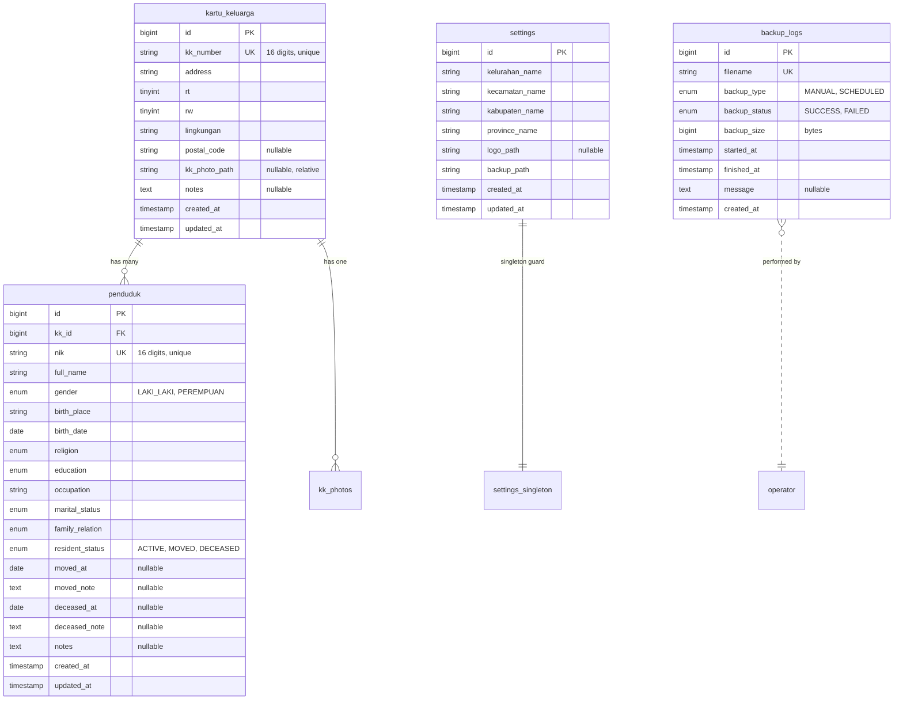

| Field | Value |
|---|---|
| **Title** | SIPETA Database Design |
| **Purpose** | Authoritative schema, relationship, validation, and migration rules for SIPETA. |
| **Scope** | MySQL 8 schema, indexes, foreign keys, naming conventions, age computation, OCR data rules. |
| **Version** | 1.1.0 |
| **Status** | Approved |
| **Last Updated** | 2026-08-03 |
| **Related Documents** | `.ai/hermes.md`, `.ai/architecture.md`, `.ai/workflow.md`, `.ai/ocr.md`, `.ai/project-rules.md`, `.ai/coding.md`, `.ai/testing.md`, `docs/REQUIREMENTS.md`, `docs/FEATURES.md` |

---

# SIPETA Database Design

This document is the authoritative reference for the SIPETA database. All AI agents MUST follow it. Schema changes require updating this document first.

## 1. Database Engine

- **Engine**: MySQL 8.0+
- **Storage**: InnoDB only
- **Charset**: `utf8mb4`
- **Collation**: `utf8mb4_unicode_ci`
- **Time zone**: server local time (configured at install)

## 2. Design Principles

1. Normalize data where practical.
2. Never duplicate KK information across rows.
3. Never store age.
4. Prefer integer foreign keys.
5. Preserve historical data.
6. Index every searchable column.
7. Document every constraint.
8. Schema changes are migration-driven; never edit released migrations.

## 3. Entity Relationship Diagram



## 4. Relationship Explanations

### 4.1 `kartu_keluarga` → `penduduk` (one-to-many)

- One KK can contain many residents.
- Foreign key: `penduduk.kk_id → kartu_keluarga.id`.
- On delete: **restrict** (cannot delete a KK that still has residents).
- On update: **cascade**.
- Eloquent: `KartuKeluarga hasMany Penduduk`, `Penduduk belongsTo KartuKeluarga`.

### 4.2 `penduduk.resident_status`

- Independent field, not a foreign key.
- Allowed values: `ACTIVE`, `MOVED`, `DECEASED`.
- Validated via enum: `App\Enums\ResidentStatus`.
- Default: `ACTIVE`.

### 4.3 `settings` (singleton)

- Only one row exists.
- Application code enforces this at the Service layer.
- The table allows multiple rows structurally, but the application will refuse to insert a second one.
- The DB does not enforce a singleton via constraint (MySQL has no partial unique index).

### 4.4 `backup_logs` (append-only)

- No foreign key.
- Inserted by the backup Service.
- Never updated or deleted.
- Cleanup is by date, not by row identity.

### 4.5 Future Tables (NOT in KKN scope)

Listed here only for documentation. Implemented in `docs/BACKLOG.md`:

- `audit_logs`
- `activity_logs`
- `notifications`
- `api_tokens`

## 5. Table: `kartu_keluarga`

Purpose: store household-level information.

### 5.1 Columns

| Column | Type | Null | Default | Notes |
|--------|------|------|---------|-------|
| `id` | `BIGINT UNSIGNED` | NO | AUTO_INCREMENT | Primary key |
| `kk_number` | `VARCHAR(16)` | NO | — | Unique; 16 digits |
| `address` | `VARCHAR(255)` | NO | — | Full street address |
| `rt` | `TINYINT UNSIGNED` | NO | — | 1–999 |
| `rw` | `TINYINT UNSIGNED` | NO | — | 1–999 |
| `lingkungan` | `VARCHAR(100)` | NO | — | Environment name |
| `postal_code` | `VARCHAR(10)` | YES | NULL | Optional |
| `kk_photo_path` | `VARCHAR(255)` | YES | NULL | Relative to `storage/kk/` |
| `notes` | `TEXT` | YES | NULL | Optional |
| `created_at` | `TIMESTAMP` | NO | — | Eloquent-managed |
| `updated_at` | `TIMESTAMP` | NO | — | Eloquent-managed |

### 5.2 Constraints & Indexes

- `UNIQUE (kk_number)` — enforces uniqueness.
- `INDEX (rt)`, `INDEX (rw)`, `INDEX (lingkungan)` — for filtering.
- `INDEX (address)` — for search.

### 5.3 Validation Rules (Form Request)

- `kk_number`: required, string, size:16, regex:/^[0-9]{16}$/, unique.
- `address`: required, string, max:255.
- `rt`: required, integer, between:1,999.
- `rw`: required, integer, between:1,999.
- `lingkungan`: required, string, max:100.
- `postal_code`: nullable, string, max:10.
- `kk_photo_path`: nullable, image, mimes:jpg,jpeg,png, max:5120.
- `notes`: nullable, string, max:5000.

## 6. Table: `penduduk`

Purpose: store every individual resident.

### 6.1 Columns

| Column | Type | Null | Default | Notes |
|--------|------|------|---------|-------|
| `id` | `BIGINT UNSIGNED` | NO | AUTO_INCREMENT | Primary key |
| `kk_id` | `BIGINT UNSIGNED` | NO | — | FK → `kartu_keluarga.id` |
| `nik` | `VARCHAR(16)` | NO | — | Unique; 16 digits |
| `full_name` | `VARCHAR(150)` | NO | — | — |
| `gender` | `ENUM('LAKI_LAKI','PEREMPUAN')` | NO | — | — |
| `birth_place` | `VARCHAR(100)` | NO | — | — |
| `birth_date` | `DATE` | NO | — | Year 1900–current |
| `religion` | `ENUM('ISLAM','KRISTEN','KATOLIK','HINDU','BUDDHA','KONGHUCU','LAINNYA')` | NO | — | — |
| `education` | `ENUM('TIDAK_SEKOLAH','SD','SMP','SMA','D1','D2','D3','S1','S2','S3')` | NO | — | — |
| `occupation` | `VARCHAR(100)` | NO | — | Free text for now |
| `marital_status` | `ENUM('BELUM_KAWIN','KAWIN','CERAI_HIDUP','CERAI_MATI')` | NO | — | — |
| `family_relation` | `ENUM('KEPALA_KELUARGA','ISTRI','ANAK','MENANTU','CUCU','ORANG_TUA','MERTUA','FAMILI_LAIN','LAINNYA')` | NO | — | — |
| `resident_status` | `ENUM('ACTIVE','MOVED','DECEASED')` | NO | 'ACTIVE' | — |
| `moved_at` | `DATE` | YES | NULL | Required when status = MOVED |
| `moved_note` | `TEXT` | YES | NULL | — |
| `deceased_at` | `DATE` | YES | NULL | Required when status = DECEASED |
| `deceased_note` | `TEXT` | YES | NULL | — |
| `notes` | `TEXT` | YES | NULL | — |
| `created_at` | `TIMESTAMP` | NO | — | — |
| `updated_at` | `TIMESTAMP` | NO | — | — |

### 6.2 Constraints & Indexes

- `UNIQUE (nik)` — enforces uniqueness.
- `FOREIGN KEY (kk_id) REFERENCES kartu_keluarga(id) ON DELETE RESTRICT ON UPDATE CASCADE`.
- `INDEX (full_name)` — for search.
- `INDEX (resident_status)` — for filtering.
- `INDEX (occupation)` — for filtering.
- `INDEX (birth_date)` — for age-related queries.
- `INDEX (gender)` — for filtering.
- `INDEX (kk_id, resident_status)` — composite for "active residents in this KK".

### 6.3 Validation Rules (Form Request)

- `kk_id`: required, integer, exists:kartu_keluarga,id.
- `nik`: required, string, size:16, regex:/^[0-9]{16}$/, unique.
- `full_name`: required, string, max:150.
- `gender`: required, in:LAKI_LAKI,PEREMPUAN.
- `birth_place`: required, string, max:100.
- `birth_date`: required, date, before_or_equal:today, after:1900-01-01.
- `religion`: required, enum value.
- `education`: required, enum value.
- `occupation`: required, string, max:100.
- `marital_status`: required, enum value.
- `family_relation`: required, enum value.
- `resident_status`: required, enum value.
- `moved_at`: required_if:resident_status,MOVED, date.
- `moved_note`: required_if:resident_status,MOVED, string, max:5000.
- `deceased_at`: required_if:resident_status,DECEASED, date.
- `deceased_note`: required_if:resident_status,DECEASED, string, max:5000.

### 6.4 Age Rule

- Never store age.
- Compute age at read time:
  ```php
  Carbon::parse($penduduk->birth_date)->age;
  ```
- All reports and the dashboard use computed age.

## 7. Table: `settings`

Purpose: store singleton configuration.

### 7.1 Columns

| Column | Type | Null | Default | Notes |
|--------|------|------|---------|-------|
| `id` | `BIGINT UNSIGNED` | NO | AUTO_INCREMENT | Primary key |
| `kelurahan_name` | `VARCHAR(150)` | NO | 'Kelurahan Tanete' | — |
| `kecamatan_name` | `VARCHAR(150)` | NO | — | — |
| `kabupaten_name` | `VARCHAR(150)` | NO | — | — |
| `province_name` | `VARCHAR(150)` | NO | — | — |
| `logo_path` | `VARCHAR(255)` | YES | NULL | Relative to `storage/logos/` |
| `backup_path` | `VARCHAR(255)` | NO | — | Absolute path |
| `created_at` | `TIMESTAMP` | NO | — | — |
| `updated_at` | `TIMESTAMP` | NO | — | — |

### 7.2 Singleton Enforcement

The Service layer enforces singleton semantics:

```php
class SettingsService
{
    public function get(): Settings
    {
        return Settings::firstOrCreate(['id' => 1], [...defaults]);
    }
}
```

DB-level enforcement is not used because MySQL lacks partial unique indexes.

## 8. Table: `backup_logs`

Purpose: append-only log of every backup attempt.

### 8.1 Columns

| Column | Type | Null | Default | Notes |
|--------|------|------|---------|-------|
| `id` | `BIGINT UNSIGNED` | NO | AUTO_INCREMENT | Primary key |
| `filename` | `VARCHAR(255)` | NO | — | Unique |
| `backup_type` | `ENUM('MANUAL','SCHEDULED')` | NO | 'MANUAL' | — |
| `backup_status` | `ENUM('SUCCESS','FAILED')` | NO | — | — |
| `backup_size` | `BIGINT UNSIGNED` | NO | — | Bytes |
| `started_at` | `TIMESTAMP` | NO | — | — |
| `finished_at` | `TIMESTAMP` | YES | NULL | — |
| `message` | `TEXT` | YES | NULL | Failure reason if any |
| `created_at` | `TIMESTAMP` | NO | — | — |

### 8.2 Constraints & Indexes

- `UNIQUE (filename)`.
- `INDEX (backup_status, created_at)`.
- `INDEX (started_at)`.

## 9. Naming Conventions

| Object | Convention | Example |
|--------|------------|---------|
| Tables | `snake_case` plural where natural | `kartu_keluarga`, `penduduk`, `backup_logs` |
| Columns | `snake_case` | `kk_number`, `full_name` |
| Primary key | `id` (BIGINT UNSIGNED) | `id` |
| Foreign key | `<parent_singular>_id` | `kk_id` |
| Unique columns | descriptive | `kk_number`, `nik` |
| Timestamps | `created_at`, `updated_at` | — |
| Enums (DB) | `UPPER_SNAKE` | `ACTIVE`, `LAKI_LAKI` |
| Enums (PHP) | PascalCase class, UPPER_SNAKE cases | `ResidentStatus::ACTIVE` |
| Models | Singular PascalCase | `KartuKeluarga`, `Penduduk` |
| Services | `<Domain>Service` | `ResidentService`, `KKService` |
| Actions | `<Verb><Noun>Action` | `CreateResidentAction` |
| Form Requests | `<Action><Resource>Request` | `StorePendudukRequest`, `UpdateKKRequest` |

Never use the KK number or NIK as a foreign key.

## 10. Migration Rules

1. Every migration MUST define foreign keys, indexes, and unique constraints.
2. Every migration MUST have a `down()` rollback.
3. Never edit a released migration. Create a new one.
4. Migration filenames: `YYYY_MM_DD_HHMMSS_description.php`.
5. Migrations run in order. Use timestamps for sequencing.
6. Always run `php artisan migrate:fresh` in a dev environment to verify rollback works.

## 11. Eloquent Relationships (Reference)

```php
class KartuKeluarga extends Model
{
    public function penduduks(): HasMany
    {
        return $this->hasMany(Penduduk::class, 'kk_id');
    }
}

class Penduduk extends Model
{
    public function kartuKeluarga(): BelongsTo
    {
        return $this->belongsTo(KartuKeluarga::class, 'kk_id');
    }

    public function scopeActive(Builder $query): Builder
    {
        return $query->where('resident_status', ResidentStatus::ACTIVE);
    }

    public function getAgeAttribute(): int
    {
        return Carbon::parse($this->birth_date)->age;
    }
}
```

## 12. Search Strategy

| Field | Match Type | Index Required |
|-------|-----------|----------------|
| `kartu_keluarga.kk_number` | exact | YES |
| `kartu_keluarga.address` | partial (LIKE) | YES |
| `kartu_keluarga.lingkungan` | exact | YES |
| `penduduk.nik` | exact | YES |
| `penduduk.full_name` | partial (LIKE) | YES |
| `penduduk.occupation` | partial (LIKE) | YES |

## 13. Filtering Strategy

All filters are SQL `WHERE` clauses (not application-side). See `docs/REQUIREMENTS.md` §2.3 for the authoritative list.

## 14. Database Golden Rules

1. Never duplicate data.
2. Never store age.
3. Never delete historical residents.
4. Always index searchable columns.
5. Always preserve referential integrity.
6. Keep schema simple.
7. Document every change in `.ai/decisions.md`.
8. Never edit a released migration.

## 15. Implementation Notes

- All column names cited here are exactly the column names used in code.
- Eloquent attribute accessors (e.g., `age`) MUST be defined in the Model, not in views.
- Use `firstOrCreate` for singleton settings.
- Use database transactions for any KK + multi-penduduk insert.

## 16. Future Improvements

Captured in `docs/BACKLOG.md`:

- Soft-delete via `deleted_at` if multi-user roles are added.
- Full-text index for search.
- Audit log table.
- Partitioning by year if dataset exceeds 200K records.
